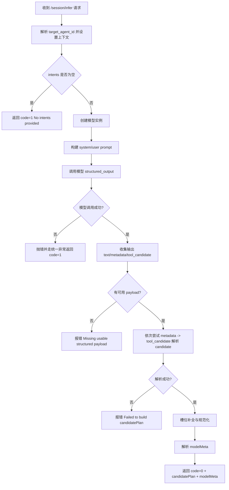
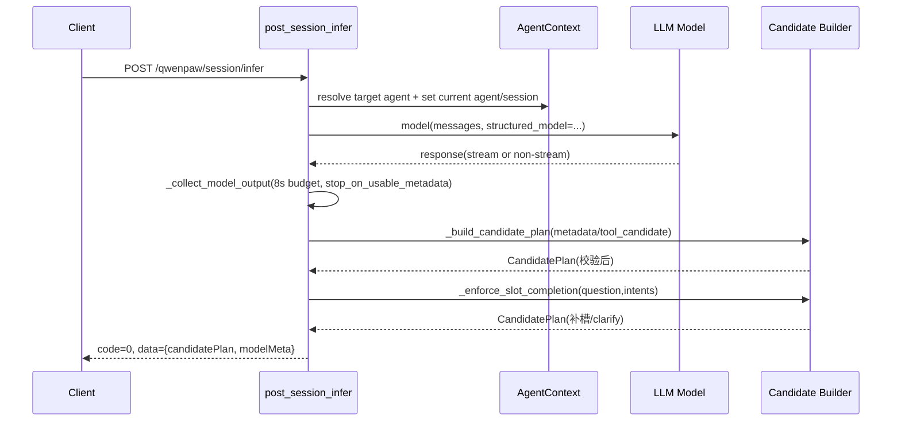

# Session Infer 接口处理逻辑维护文档

## 1. 文档目的

本文档用于维护 `POST /qwenpaw/session/infer` 接口的核心处理逻辑，帮助后续开发快速理解：

- 请求进入后如何路由与上下文绑定
- 模型调用前如何构建约束提示词
- 模型返回后如何解析、校验、补槽与澄清
- 失败分支与日志观测点在哪里

源码文件：

- `src/qwenpaw/app/routers/session_infer.py`

---

## 2. 接口职责（TL;DR）

`/session/infer` 的职责是：基于 `question + intents`，选择唯一 intent，生成 `candidatePlan`，并返回 `modelMeta`。

返回结构核心字段：

- `candidatePlan.intentCode`
- `candidatePlan.executionMode`
- `candidatePlan.confidence`
- `candidatePlan.slots`
- `candidatePlan.needClarify`
- `candidatePlan.clarifyQuestion`
- `modelMeta.provider/model/promptVersion/requestId`

---

## 3. 入口与主流程

入口函数：`post_session_infer(...)`

主流程可分为 9 步：

1. 解析目标 agent，并写入上下文
2. 入参基础校验（`intents` 不能为空）
3. 创建模型实例
4. 构造 system/user prompt
5. 调用结构化模型输出
6. 收集模型输出（兼容流式与非流式）
7. 从 metadata/tool_candidate 提取候选
8. 构建 candidatePlan 并做服务端强校验
9. 槽位补全、澄清判定、组装响应与日志

---

## 4. 关键数据模型

### 4.1 请求模型

- `SessionInferRequest`
  - `question`（必填）
  - `traceId`
  - `intents[]`
  - `routingPolicy`
  - `outputSchema`
  - `sessionId/conversationId/chatId/agentId`

### 4.2 响应模型

- `SessionInferResponse`
  - `code`
  - `message`
  - `data: SessionInferData`
- `SessionInferData`
  - `candidatePlan: CandidatePlan`
  - `modelMeta: ModelMeta`

### 4.3 结构化输出约束

模型结构化输出通过 `SessionInferStructuredOutput` 约束，要求包含：

- `candidatePlan`（且字段额外 key 禁止）
- `modelMeta`（当前实现中不作为主返回来源）

---

## 5. Prompt 构建策略

函数：`_build_messages(payload)`

核心行为：

- 将 intents 压缩为 `compact_intents`
- `description` 截断到 `SESSION_INFER_PROMPT_MAX_DESCRIPTION_CHARS=160`
- 把 `routingPolicy/outputSchema/intents` 作为 JSON 写入 user prompt
- system prompt 明确硬约束：
  - 仅选一个 intent
  - `intentCode` 必须来自请求给定 intents
  - `executionMode` 必须与选中 intent 一致
  - `roleCode/sqlTemplateCode/selectedTableId` 必须来自选中 intent
  - 信息不足必须 `needClarify=true`
  - `confidence` 必须在 `[0,1]`

说明：这一层是“提示词约束”，并非最终可信边界，真正边界在服务端强校验（见第 7 节）。

---

## 6. 模型调用与输出收集

### 6.1 模型调用

调用方式：

- `model(messages, structured_model=SessionInferStructuredOutput)`

若调用失败会记录 `structured_error_type` 并走失败分支。

### 6.2 输出收集函数

函数：`_collect_model_output(...)`

收集内容：

- `response_text`
- `response_metadata`
- `response_tool_candidate`（从 `content` 中反向扫描 `tool_use` block 的 `input/raw_input`）

流式场景关键点：

- 记录 `first_chunk_ms`、`stream_chunk_count`
- 在收集时限 `SESSION_INFER_COLLECT_BUDGET_MS=8000` 达到后截断
- 当 `stop_on_usable_metadata=True` 且 metadata 已包含可用 `intentCode + executionMode` 时提前结束

非流式场景关键点：

- 直接从 response 对象提取 text/metadata/content

---

## 7. CandidatePlan 构建与强校验

函数：`_build_candidate_plan(output_raw, intents)`

校验逻辑（关键）：

1. `intentCode` 必填且必须在请求 intents 中
2. `executionMode` 必填，且若模型提供值与 intent 配置冲突则报错
3. `confidence` 转 float，无法转换报错，最终 clamp 到 `[0,1]`
4. `slots` 非 dict 则降级为空 dict
5. `roleCode/sqlTemplateCode/selectedTableId` 若与 intent 配置冲突则报错
6. `needClarify` 兼容字符串布尔值
7. `needClarify=false` 时强制清空 `clarifyQuestion`

候选来源优先级：

1. `metadata`
2. `tool_candidate`

若两者都不可用或都校验失败，接口返回 `code=1` 并写异常日志。

---

## 8. 槽位补全与澄清逻辑

函数链：

- `_enforce_slot_completion(...)`
- `_complete_candidate_slots_from_question(...)`
- `_extract_slot_from_question(...)`

核心策略：

1. 槽位白名单过滤
   - 若 intent 定义了 `slotKeys`，只保留这些 key，避免模型输出越界槽位
2. 枚举值归一化
   - 基于 `slotSchema.properties[*].x-enum-aliases`
   - 叠加 `enumValueHints`
3. 必填槽位补全
   - 从 `slotSchema.required` 获取必填项
   - 先按枚举别名在 question 中匹配
   - 再按 `slotMapping` 的别名+正则抽取值（支持“字段是/为/=/: value”）
4. 澄清判定
   - 仍缺必填槽位时，强制：
     - `needClarify=true`
     - `clarifyQuestion="请补充以下必要参数：..."`

附加规则：

- 若本次补槽成功且原始 `confidence<=0`，会将 confidence 提升到 `0.6`（仅在不需要澄清时）。

---

## 9. ModelMeta 解析逻辑

函数：`_resolve_effective_model_meta(agent_id, trace_id)`

来源顺序：

1. 优先取 agent 的 `active_model`
2. 若 agent 未配置，则回退全局 active model
3. 仍失败则返回 `provider/model = "unknown"`

`requestId` 生成规则：

- `traceId` 非空则直接使用
- 否则生成 `qwenpaw-<12位随机hex>`

---

## 10. 异常与返回语义

### 10.1 正常返回

- `code=0`
- `message="ok"`
- `data` 含 `candidatePlan + modelMeta`

### 10.2 业务失败返回

- `intents` 为空：`code=1, message="No intents provided"`
- 模型结构化输出不可用、payload 缺失、候选校验失败等：`code=1, message=<异常信息>`

### 10.3 HTTPException 分支

- 捕获后返回 `code=<status_code>, message=<detail>`

---

## 11. 观测与时延预算

关键预算常量：

- `SESSION_INFER_TOTAL_BUDGET_MS = 18000`（总链路软预算）
- `SESSION_INFER_COLLECT_BUDGET_MS = 8000`（流式收集预算）

日志埋点覆盖：

- `resolve_agent_ms`
- `model_create_ms`
- `build_prompt_ms`
- `model_call_ms`
- `collect_ms`
- `parse_ms`
- `candidate_ms`
- `total_ms`
- `response_source/metadata_hit/tool_candidate_hit`
- `slot_completion_changed/filled/missing_required`
- `structured_enabled/non_stream_enforced/structured_error_type`

---

## 12. Mermaid 流程图

---

## 13. Mermaid 时序图

---

## 14. 后续维护建议

当以下逻辑变更时，请同步更新本文档：

- 请求/响应模型字段变更
- system prompt 的硬约束条款变更
- candidate 校验规则（尤其一致性约束）
- 槽位补全策略（正则、alias、required）
- 预算常量与日志字段

