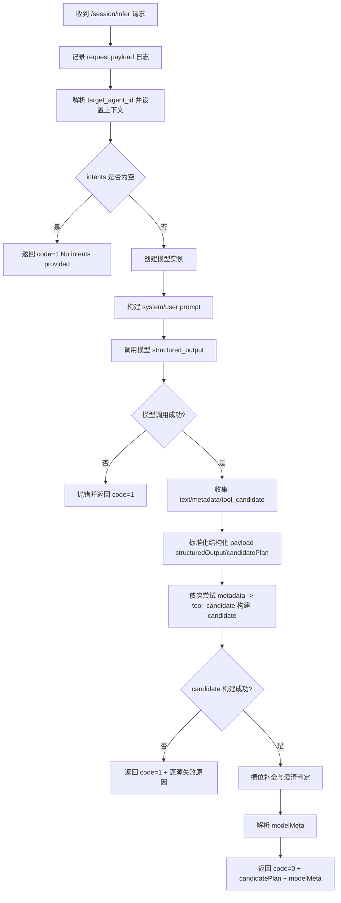
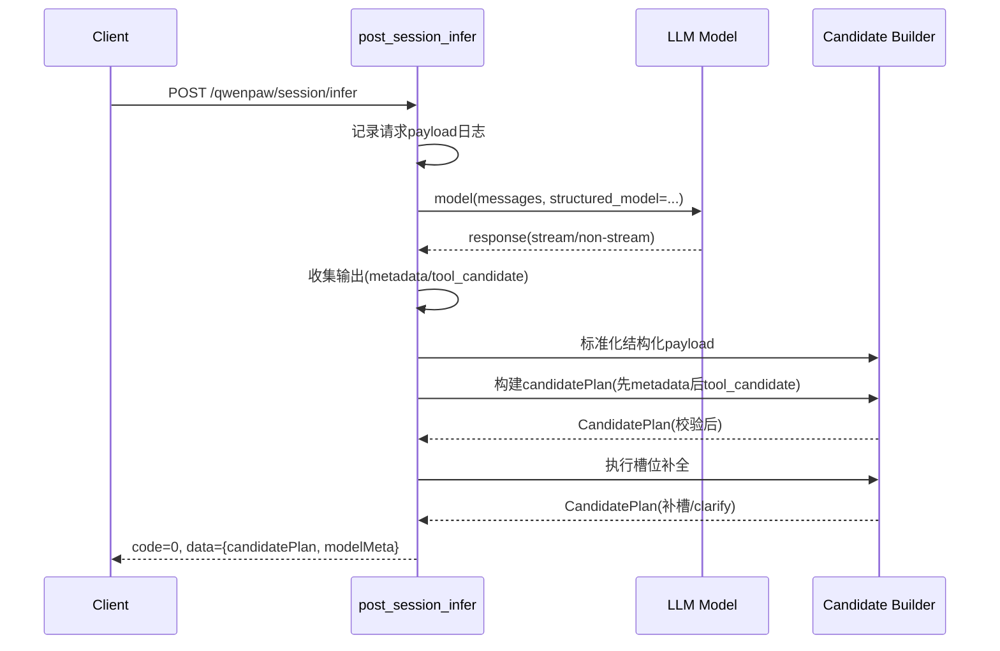

# Session Infer 接口处理逻辑维护文档

## 1. 文档目的

本文档维护 `POST /qwenpaw/session/infer` 的当前实现逻辑，便于排查：

- 请求进入后的上下文与 agent 解析
- 模型调用与输出收集
- 结构化 payload 解析、candidate 构建与补槽
- 关键日志与失败分支

源码文件：

- `src/qwenpaw/app/routers/session_infer.py`

---

## 2. 接口职责（TL;DR）

接口目标：基于 `question + intents` 生成受控 `candidatePlan`，并返回 `modelMeta`。

核心返回字段：

- `candidatePlan.intentCode`
- `candidatePlan.executionMode`
- `candidatePlan.confidence`
- `candidatePlan.slots`
- `candidatePlan.needClarify`
- `candidatePlan.clarifyQuestion`
- `modelMeta.provider/model/promptVersion/requestId`

---

## 3. 主流程

入口函数：`post_session_infer(...)`

主流程（当前版本）：

1. 记录请求日志（直接打印 `payload.model_dump()`）
2. 解析目标 agent 并绑定上下文
3. 校验 `intents` 非空
4. 创建模型实例
5. 构造 prompt（system + user）
6. 调用结构化模型输出
7. 收集模型输出（流式/非流式）
8. 从 `metadata/tool_candidate` 解析 source candidates
9. 构建 `candidatePlan`（强校验）
10. 槽位补全与澄清判定
11. 组装 `modelMeta` 并返回

---

## 4. 关键数据模型

### 4.1 请求模型

- `SessionInferRequest`
  - `question`（必填）
  - `traceId`
  - `intents[]`
  - `routingPolicy`
  - `outputSchema`
  - `sessionId/conversationId/chatId/agentId`

### 4.2 响应模型

- `SessionInferResponse`
  - `code`
  - `message`
  - `data: SessionInferData`
- `SessionInferData`
  - `candidatePlan: CandidatePlan`
  - `modelMeta: ModelMeta`

### 4.3 结构化输出模型

服务端调用模型时使用 `SessionInferStructuredOutput` 作为结构化约束：

- `candidatePlan`
- `modelMeta`

说明：实际返回可能存在 provider 包装层（如 `structuredOutput`），服务端有额外解包逻辑兜底（见第 6 节与第 7 节）。

---

## 5. Prompt 构建策略

函数：`_build_messages(payload)`

关键点：

- intents 压缩为 `compact_intents`
- `description` 截断到 `SESSION_INFER_PROMPT_MAX_DESCRIPTION_CHARS=160`
- `routingPolicy/outputSchema/intents` 以 JSON 写入 user prompt
- system prompt 明确硬约束：
  - 只选一个 intent
  - `intentCode` 必须来自候选 intents
  - `executionMode` 必须与选中 intent 一致
  - `roleCode/sqlTemplateCode/selectedTableId` 不允许编造
  - 信息不足时 `needClarify=true`
  - `confidence` 必须在 `[0,1]`

---

## 6. 模型调用与输出收集

### 6.1 模型调用

调用方式：

- `model(messages, structured_model=SessionInferStructuredOutput)`

失败时记录 `structured_error_type` 并走异常分支。

### 6.2 输出收集

函数：`_collect_model_output(response, stop_on_usable_metadata=True)`

收集内容：

- `response_text`
- `response_metadata`
- `response_tool_candidate`（从 content 中反向扫描 `tool_use`）
- `first_chunk_ms`
- `stream_chunk_count`
- `valid_metadata_at_chunk_idx`

当前行为：

- 支持流式与非流式
- `stop_on_usable_metadata=True` 时，拿到可用 metadata 可提前退出流读取
- **不再有 collect 超时预算截断逻辑**

---

## 7. 结构化 payload 标准化与 Candidate 构建

### 7.1 结构化 payload 标准化

函数：

- `_normalize_structured_metadata(raw)`
- `_normalize_structured_payload(raw)`

处理能力：

1. 支持 dict 直接透传
2. 支持对象 `model_dump()`
3. 支持字符串 JSON 解析为 dict
4. 递归解包 wrapper：
   - `structuredOutput`
   - `candidatePlan`

目的：将 provider 形态差异收敛为统一 payload，以便后续提取 `intentCode/executionMode`。

### 7.2 CandidatePlan 构建与校验

函数：`_build_candidate_plan(output_raw, intents)`

预处理：

- 先对 `output_raw` 做 `_normalize_structured_payload` 标准化
- 再对 `candidatePlan` 做最多 5 层的嵌套解包（`candidatePlan -> candidatePlan -> ...`），兼容部分模型/供应商的重复包装

校验规则（关键）：

1. `intentCode` 必填且必须在请求 intents 中
2. `executionMode` 必填，且与 intent 配置一致
3. `confidence` 可转换为 float，最终 clamp 到 `[0,1]`
4. `slots` 非 dict 时降级为空 dict
5. `roleCode/sqlTemplateCode/selectedTableId` 与 intent 不一致时报错
6. `needClarify` 支持字符串布尔值归一化
7. `needClarify=false` 时强制清空 `clarifyQuestion`

候选来源顺序：

1. `metadata`
2. `tool_candidate`

若都失败，返回 `code=1`，并在错误信息中包含逐源失败原因。

---

## 8. 槽位补全与澄清逻辑

函数链：

- `_enforce_slot_completion(...)`
- `_complete_candidate_slots_from_question(...)`
- `_extract_slot_from_question(...)`

核心策略：

1. 槽位白名单
   - 若定义了 `slotKeys`，仅保留白名单 key
2. 枚举归一化
   - `slotSchema.properties[*].x-enum-aliases`
   - `enumValueHints`
3. 必填补槽
   - 必填来自 `slotSchema.required`
   - 先枚举别名匹配，再别名+正则抽取
4. 澄清判定
   - 仍缺必填时：
     - `needClarify=true`
     - `clarifyQuestion="请补充以下必要参数：..."`

补充：

- `_slot_mapping(intent)` 当前只读取 `slotSchema.slotMapping`（不再回退顶层 `slotMapping`）。
- 若补槽后满足条件且原始 `confidence<=0`，会提升到 `0.6`。

---

## 9. ModelMeta 解析逻辑

函数：`_resolve_effective_model_meta(agent_id, trace_id)`

来源顺序：

1. agent `active_model`
2. 全局 active model
3. fallback：`provider/model = "unknown"`

`requestId`：

- 优先 `traceId`
- 否则 `qwenpaw-<12位随机hex>`

---

## 10. 异常与返回语义

### 10.1 正常返回

- `code=0`
- `message="ok"`
- `data` 包含 `candidatePlan + modelMeta`

### 10.2 业务失败

- `intents` 为空：`code=1, message="No intents provided"`
- 模型结构化输出不可用 / payload 缺失 / candidate 校验失败：
  - `code=1`
  - `message=<异常信息>`

### 10.3 HTTPException 分支

- `code=<status_code>`
- `message=<detail>`

---

## 11. 观测与日志（当前版本）

### 11.1 日志输出原则

- 对象型日志统一用 JSON 串输出（`_json_for_log`）
- `_json_for_log` 内部做异常兜底，不允许日志序列化影响主流程

### 11.2 关键日志点

- 请求入口：
  - `会话推理请求载荷 payload=%s`（直接 `payload.model_dump()`）
- 阶段耗时：
  - `会话推理阶段=解析agent`
  - `会话推理阶段=创建模型`
  - `会话推理阶段=构建提示词`
  - `会话推理阶段=模型调用`
  - `会话推理阶段=收集输出`
  - `会话推理阶段=解析载荷`
  - `会话推理阶段=candidate处理`
  - `会话推理阶段=解析模型元信息`
  - `会话推理耗时汇总`（总览）
- 数据调试：
  - `会话推理收集结果-metadata`
  - `会话推理收集结果-tool_candidate`
  - `candidate_before/candidate_after`
- 常见告警/错误：
  - `会话推理metadata不完整`
  - `会话推理candidate解析失败`
  - `会话推理失败`

---

## 12. Mermaid 流程图（当前版本）

---

## 13. Mermaid 时序图（当前版本）

---

## 14. 后续维护建议

当以下逻辑变化时，请同步更新本文档：

- 请求/响应模型字段
- prompt 硬约束
- payload 包装层形态（如 `structuredOutput`）
- candidate 校验规则
- 槽位补全与映射规则（尤其 `slotSchema.slotMapping`）
- 日志字段与阶段打点
